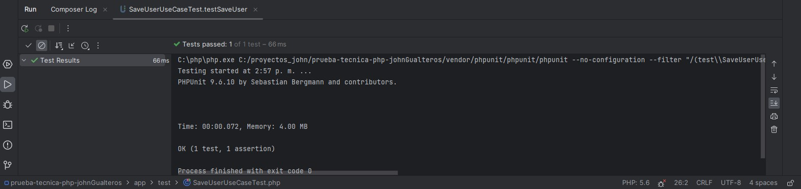
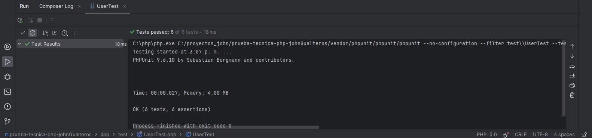

## Prueba tecnica Php
Clona el Proyecto
```shell
git clone https://github.com/johngualteros/prueba-tecnica-php-johnGualteros.git
```
asegurate de tener composer instalado y ejecuta el siguiente comando
```shell
composer install
```
Ya con eso puedes ejecutar los tests que estan en
/app/test aqui pantallazos de que funcionan los tests


